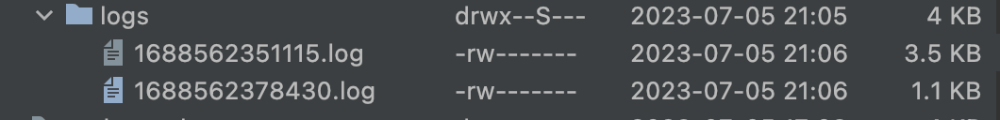
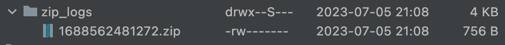
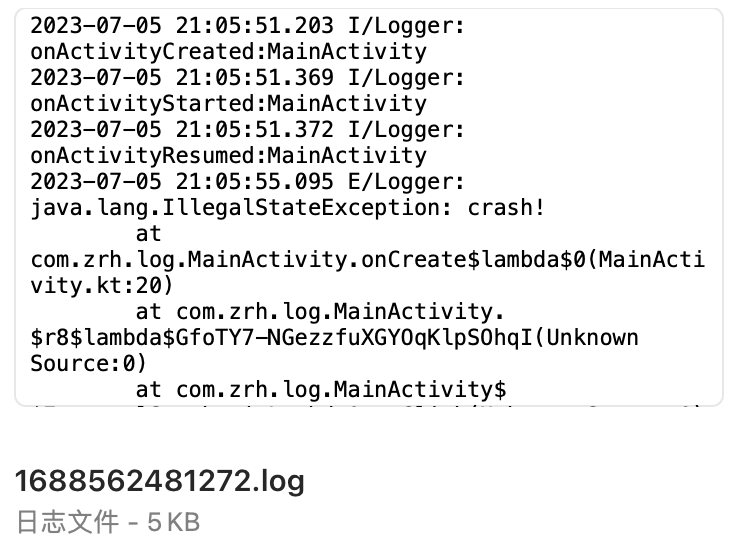

# Android-Logger

Android高性能日志框架，支持自定义Printer，内置LogcatPrinter和DiskPrinter，DiskPrinter支持以下特性：

1. 支持异步写入日志到文件；
2. 支持设置分片日志文件大小和文件数；
3. 支持zip压缩合并日志文件；

[下载地址](https://github.com/zrh1994/Android-Logger/releases/download/v1.0.0/logger-v1.0.aar)

### 使用步骤

#### 1.下载AAR并添加到项目中。

```groovy
implementation fileTree(dir: 'libs', include: ['*.jar', '*.aar'])
```

#### 2.初始化Logger添加Printer。

```kotlin
Logger.addPrinter(LogcatPrinter(true))
Logger.addPrinter(DiskPrinter(File(cacheDir, "logs")).apply {
    // 目录下的文件总大小设置为20kb
    setMaxFileLength(4 * 1024)
    setMaxFileCount(5)
})
```

DiskPrinter会将日志记录到指定目录下的日志文件中：


#### 3.调用Logger方法打印日志。

```kotlin
override fun onActivityCreated(activity: Activity, savedInstanceState: Bundle?) {
    Logger.i("Logger", "onActivityCreated:" + activity.localClassName)
}
```

#### 4.记录crash日志。

```kotlin
Thread.setDefaultUncaughtExceptionHandler { _, e ->
    Logger.getPrinter(DiskPrinter::class.java).printCrash("Logger", e)
    exitProcess(0)
}
```

#### 5.压缩日志

```kotlin
val printer = Logger.getPrinter(DiskPrinter::class.java)
val dir = File(cacheDir, "zip_logs")
val fileName = "${System.currentTimeMillis()}"
val output = printer.zipLatestLogs(dir, fileName, 5 * 1024 * 1024)
```

压缩日志会将所有日志文件合并到一个文件中然后输出zip文件：

